# 01_lab1Web

PEMROGRAMAN WEB

UNIVERSITAS PELITA BANGSA

TEKNIK INFORMATIKA

UNIVERSITAS PELITA BANGSA

NAMA : GUNAWAN

NIM     : 312010191

KELAS   : TI.20.B1

DOSEN   : Agung Nugroho,S.Kom.,M.Kom

#_**Praktikum 1: HTML Dasar**_

**Instruksi Praktikum**
1. Persiapkan text editor misalnya VSCode.
2. Buat file baru dengan nama lab1_tag_dasar.html
3. Buat struktur dasar dari dokumen HTML.
4. Ikuti langkah-langkah praktikum yang akan dijelaskan berikutnya.
5. Lakukan validasi dokumen html dengan mengakses http://validator.w3.org

**Langkah-langkah Praktikum**

Persiapan membuka VSCode dan Browser.

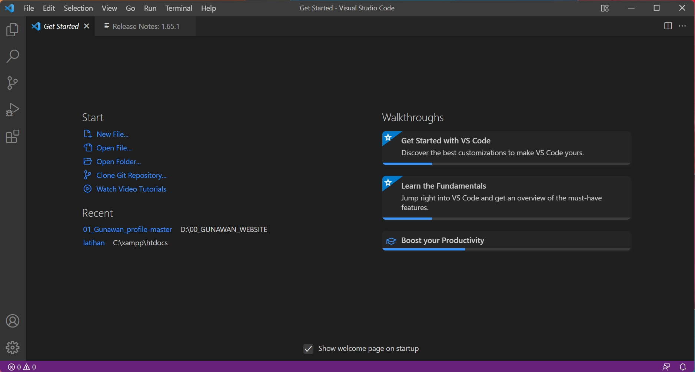

Gambar 01.Tampilan VSCode

Kemudian buat file baru dengan nama lab1_tag_dasar.html dan tambahkan tag dasar dokumen 
HTML

**Modul Praktikum Pemrograman Web**

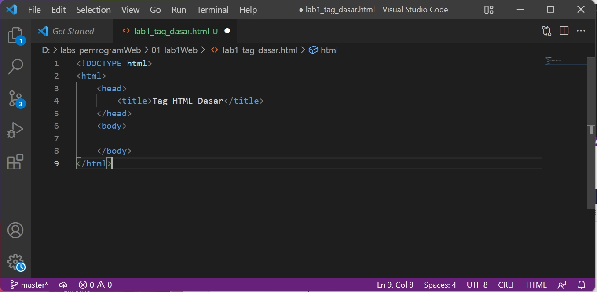

Gambar 02. Code HTML Dasar

Kemudian selanjutnya, buka file tersebut pada web browser misalnya **Google Chrome**.

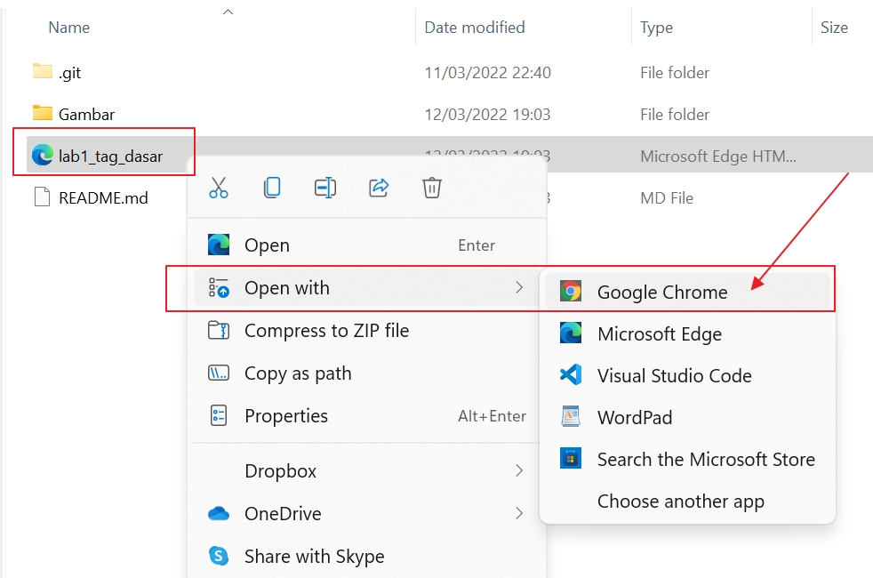

Gambar 03. Open File html Google Chrome

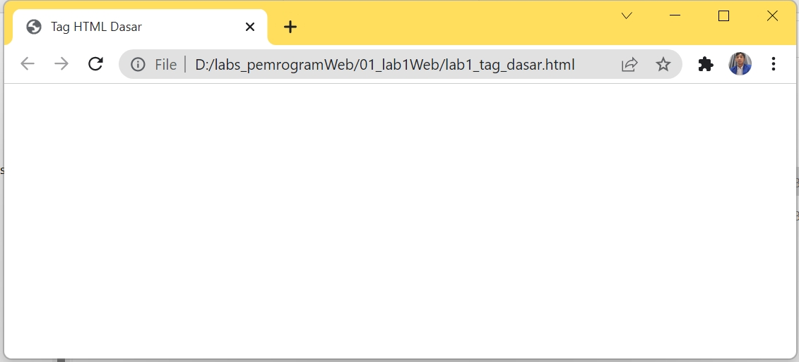

Gambar 04. Web Browser Google Chrome

**1. Membuat Paragraf**<br>
Selanjutnya buatlah beberapa paragraf sederhana sebagai berikut<br>

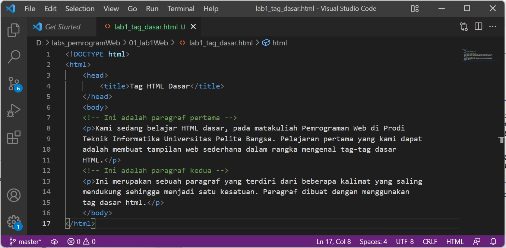

Gambar 05. Menambah Code paragraf sederhana

Selanjutnya simpan kembali perubahannya, dan lakukan refresh pada web browser, lihat hasilnya.<br>
**Modul Praktikum Pemrograman Web**

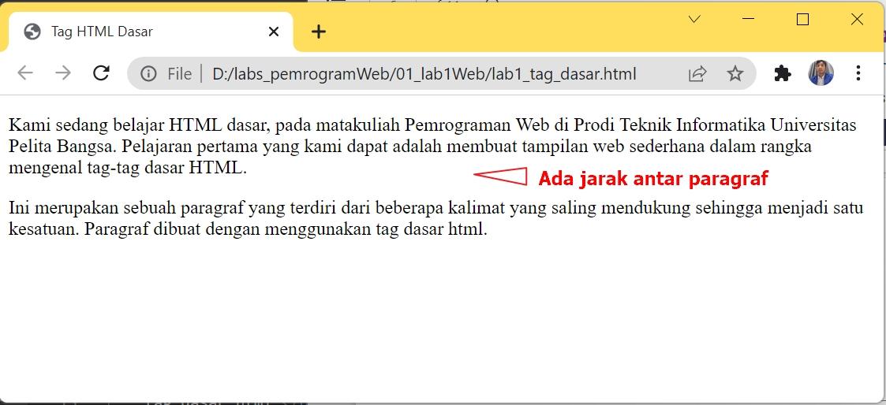

Gambar 06.Tampilan_Paragraf_pada_Browser

Kemudian atur atribut paragraf seperti berikut, dan amati perubahanya.<br>
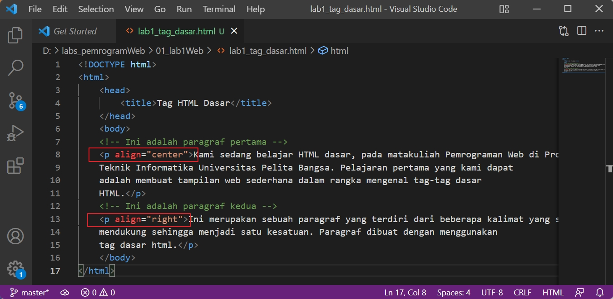

Gambar 07. Menambah Code atur atribut paragraf

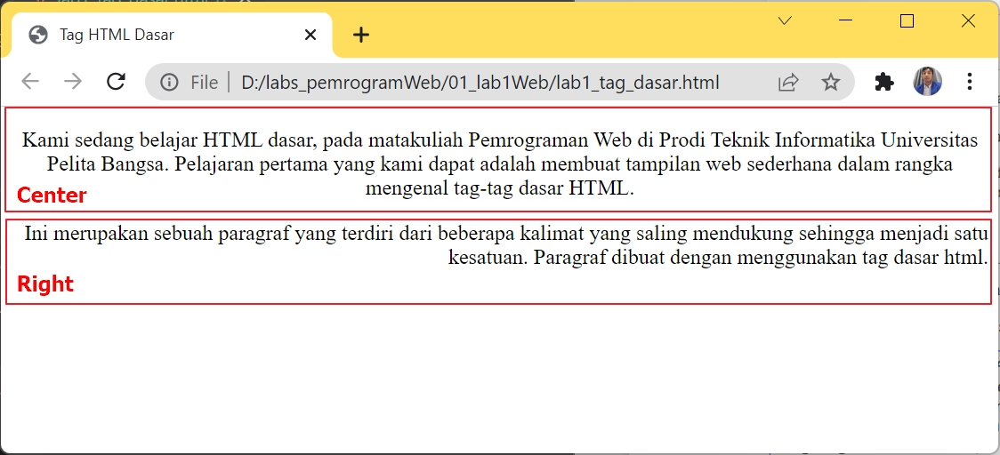

Gambar 08. Menampilkan Code atur atribut paragraf Center dan Right pada Browser<br>

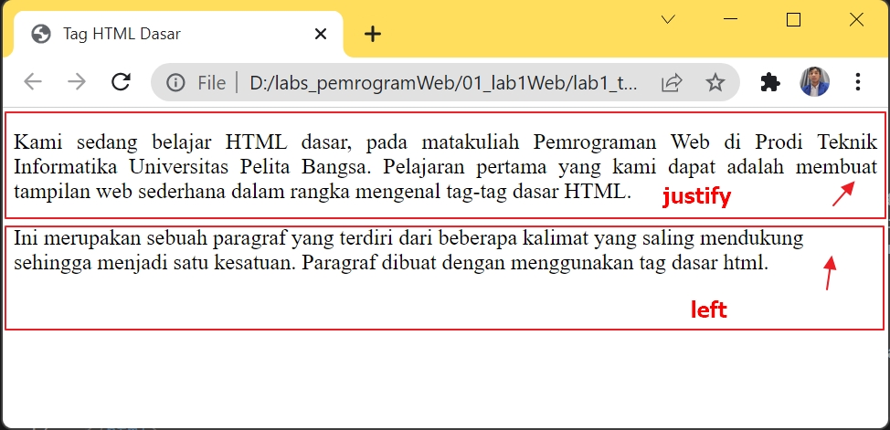

Gambar 09. Menampilkan Code atur atribut paragraf Justify dan left pada Browser<br>

**2. Menambahkan Judul**

Seperti sudah dijelaskan pada materi bahwa judul memiliki 6 level yaitu mulai h1 sampai h6. 
Kemudian tambahkan judul h1 sebelum paragraf pertama dan tambahkan sub judul h2 sebelum 
paragraf kedua.
  
 > ``<!-- judul paragraf pertama -->``<br>
     ``<h1>Belajar Dasar HTML</h1>``

  ``<!-- judul paragraf kedua -->``<br>
  ``<h2>Paragraf pada HTML</h2>``<br>
  
Simpan perubahannya dan lihat hasilnya dengan melakukan refresh pada browser.

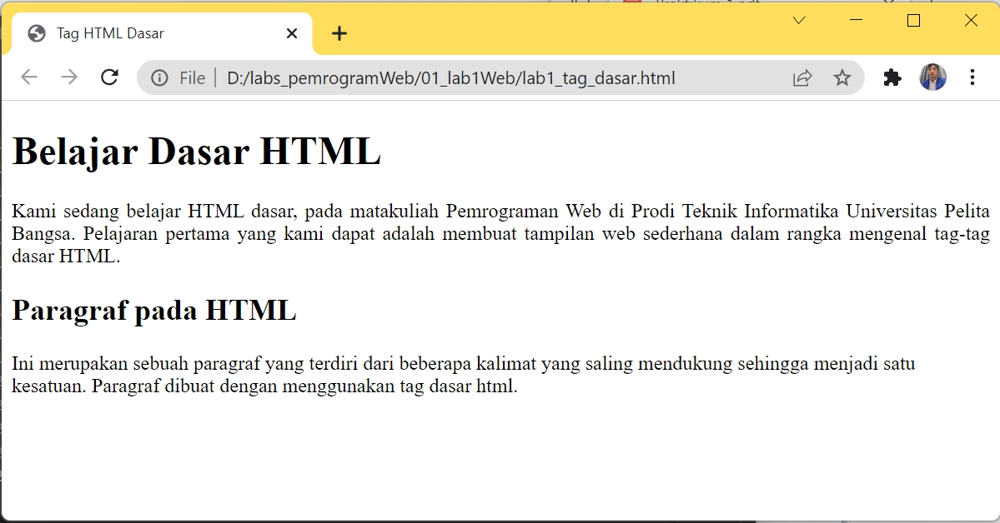

Gambar 10. Tampilan Heading 1 dan Heading 2

**3. Memformat teks**

Lakukan pemformatan teks yang ada pada paragraf yang sudah ada sebelumnya, mengacu kepada penjelasan materi pemformatan teks, sehingga tampilannya seperti berikut.

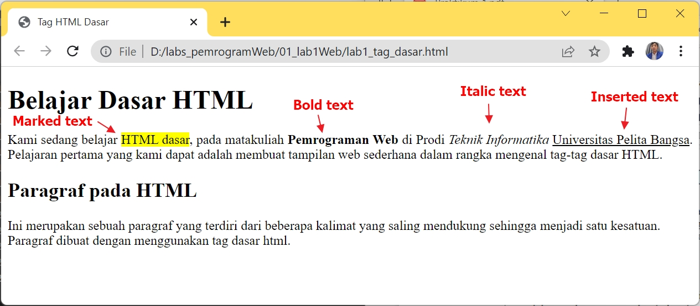

Gambar 11. Pemformatan Teks

Lakukan eksperimen lainnya dengan tag-tag pemformatan teks yang ada.

**4. Menyisipkan Gambar**

Untuk menyisipkan gmbar, siapkan gambar yang akan disisipkan pada halaman web, kemudian 
simpan file gambar tersebut satu folder dengan file dokumen html. Atau bisa juga menyisipkan 
gambar dari website external.<br>

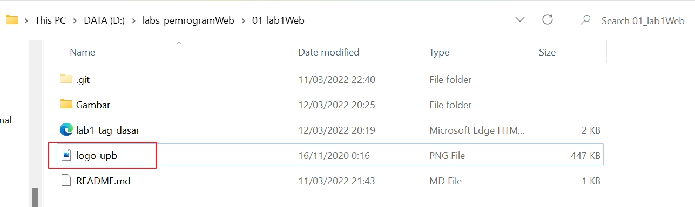

Gambar 12. Menyisipkan File Gambar

Kemudian tambahkan tag img setelah paragraf yang kedua, dengan menambahkan heading 3
sebelumnya

 >``<!-- sub judul paragraf -->``<br>
 ``<h3>Menambahkan Gambar</h3>``
 
 ``<!-- menambahkan gambar pada dokumen -->``<br>
 ````
 
Simpan perubahannya, kemudian refresh browser.

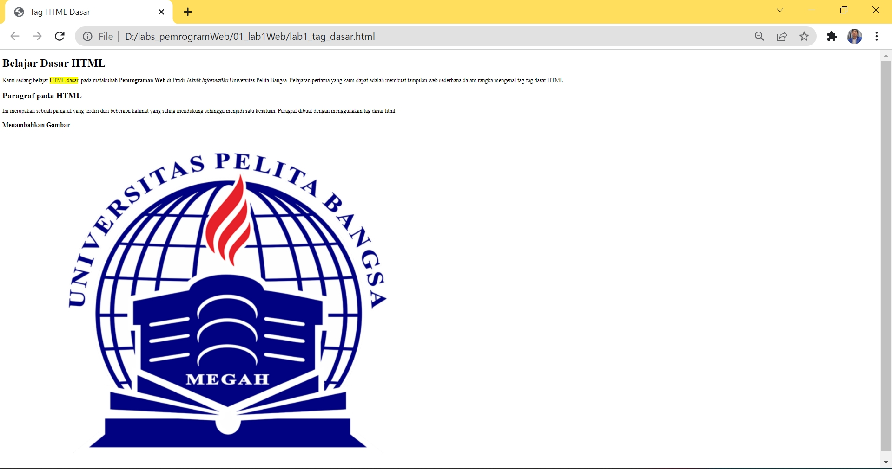

Gambar 13. File Gambar Original Size

Gambar akan ditampilkan apa adanya sesuai dengan ukuran aslinya. Untuk mengatur ukuran 
gambar, dapat digunakan atribut witdh dan height dengan nilai integer yang disesuaikan

 >``<!-- menambahkan gambar pada dokumen -->``<br>
 ````

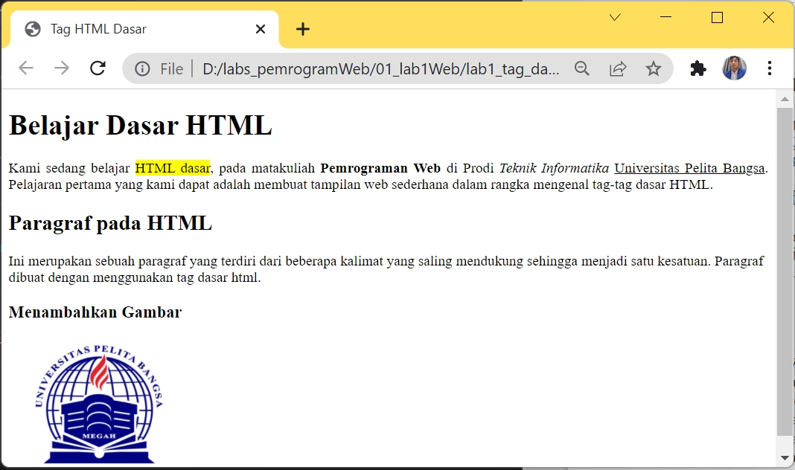

Gambar 14. File Gambar Size width 200

**5. Menambahkan Hyperlink**

Tambahkan hyperlink pada dokumen sebelum heading 1 seperti berikut.

 >``<!-- menambahkan link navigasi -->``<br>
  ``<nav>``<br>
  ``<a href="lab1_tag_dasar.html">Dasar HTML</a>``<br>
  ``<a href="lab1_halaman2.html">Halaman 2</a>``<br>
  ``<a href="http://www.google.com">Halaman Web Eksternal Google</a>``<br>
  ``</nav>``<br>
  ``<hr>``<br>
  
Buat satu file lagi dengan nama lab1_halaman2.html kemudian isi dokumen tersebut dengan tag 
html dasar dan dengan isi bebas, boleh mengcopy dari halaman sebelumnya. 

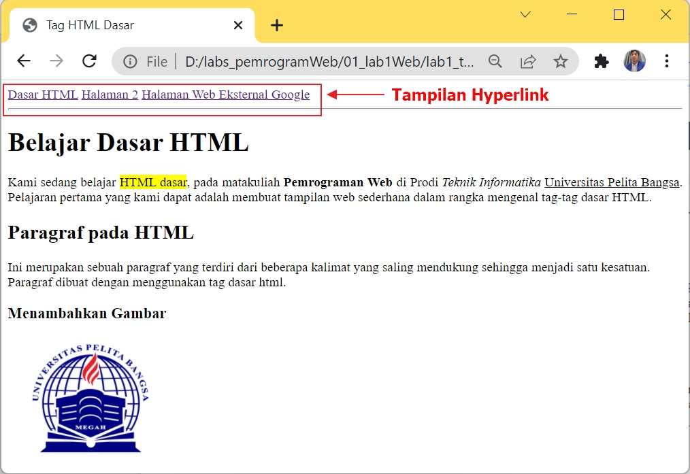

Gambar 15. Tampilan Hyperlink

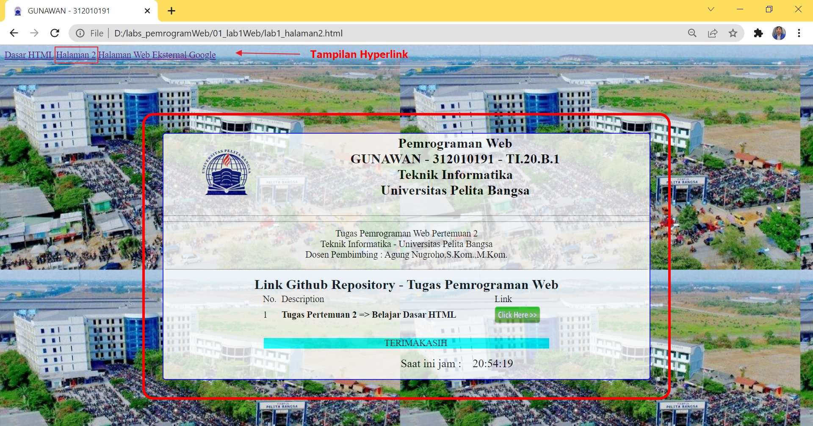

Gambar 16. Tampilan Hyperlink Halaman 2

**Jawab Pertanyaan Berikut**

1. Lakukan perubahan pada kode sesuai dengan keinginan anda, amati perubahannya adakah error ketika terjadi kesalahan penulisan tag?
 >**Jawab:**
 >Kadang saya salah dalam penulisan tag.Tapi masih bisa di tampilkan ke Browser tampilan di websitenya akan menjadi berantakan bila kita ada kesalahan.
 Jadi, saat kita menambahkan beberapa script HTML dan saat scriptnya sudah panjang sekali sampai puluhan baris biasanya. Yang menjadi kebiasaannya adalah sering lupa dengan aturan penulisan tag HTMLnya. Khususnya yang berpasangan seperti tag “``<buka></tutup>``“. Biasanya ada yang menulis script tanda bukanya tapi lupa tag tutupnya sehingga semua pondasi jadi berubah
 
2. Apa perbedaan dari tag ``<p>`` dengan tag ``<br>``, berikan penjelasannya!
  >**Jawab:**
  Sekilas fungsi tag ``<p>`` dan ``<br/>`` terkesan sama, yaitu untuk memulai baris baru atau bisa diibratkan sebagai fungsi enter pada keyboard, namun sebenarnya kedua tag html ini memiliki fungsi dan intruksi yang berbeda pada perintah html.<br>
  **Tag ``<p>``**<br>
Tag ini berfungsi untuk memberi perintah paragraf baru pada halaman html, antara baris atau paragraf terbentuk jarak.
Tag ini merupakan tag yang berpasangan, dimulai dengan tag pembuka ``<p>`` dan diakhiri dengan tag penutup ``</p>``<br>
**Tag ``<br/>``**<br>
Tag ``<br/>`` tag ini adalah tag tunggal tanpa diawali tag pembuka dan diakhiri tag penutup. Ia berdiri sendiri.
Tag ``<br/>`` dituliskan pada kerangka html untuk memberikan perintah "break line", artinya meng intruksikan baris baru.
Apa beda nya dengan tag paragraf .... ?, bedanya adalah baris baru yang dihasilkan tanpa memberi jarak dengan baris diatasnya.
Jadi perbedaan yang mencolok dari kedua tag ini adalah pada jarak yang terbentuk.
Kesimpulannya jika hanya ingin membuat baris baru tanpa jarak gunakan tag ``<br/>`` , tapi jika sobat ingin membuat baris baru namun memiliki jarak dengan paragraf diatasnya maka bungkuslah paragraf baru tersebut dengan sepasang tag ``<p>`` dan ``</p>``
    
3. Apa perbedaan atribut title dan alt pada tag ````, berikan penjelasannya!
 >**Jawab:** 
 >Perbedaan yaitu pada gambar yang di tampilkan pada browser
 >**Title**<br>
  Parameter title pada tag ```` berfungsi sebagai memberikan judul pada gambar dan judul / title akan tampil jika cursor kita arahkan pada gambar seperti pada contoh dibawah>

  >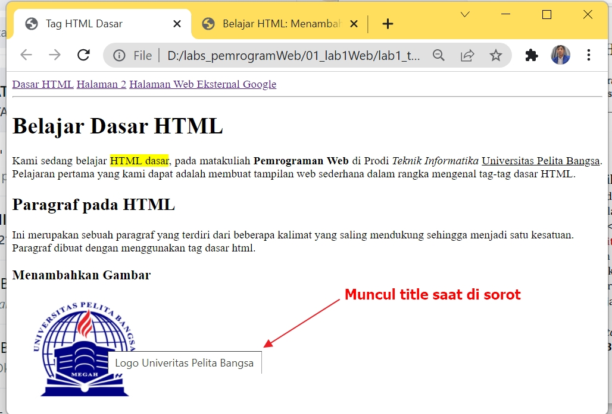
 
  >**Alt**<br>
   Sedangkan parameter alt pada tag ```` berfungsi juga sama pada parameter title, hanya saja parameter alt ini akan di tampilkan jika gambar gagal dimuat. Disini saya contohkan ketika saya secara sengaja menginputkan nama file yang salah pada link src, berikut ada contoh hasil parameter alt>
   
   >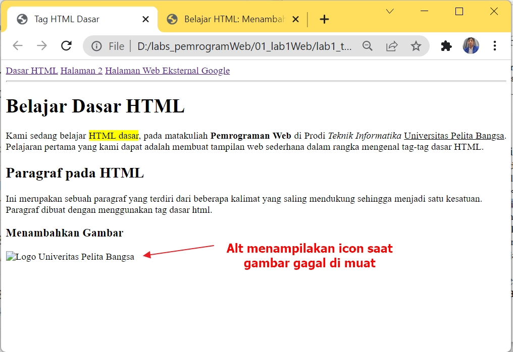
   
4. Untuk mengatur ukuran gambar, digunakan atribut width dan height. Agar tampilan gambar 
proporsional sebaiknya kedua atribut tersebut diisi semua atau tidak? Berikan penjelasannya!
 >**Jawab:**
 >Menurut saya agar tampilan gambar proporsional sebaiknya menggunakan satu atribut.Agaraspecratio gambar asli tetap terjaga.
 
 >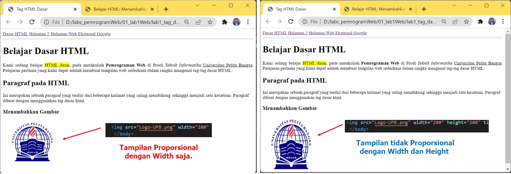
 
5. Pada link tambahkan atribut target dengan nilai atribut bervariasi ``( _blank, _self, _top, 
_parent )``, apa yang terjadi pada masing-masing nilai antribut tersebut?. 
 >**Jawab:**
 >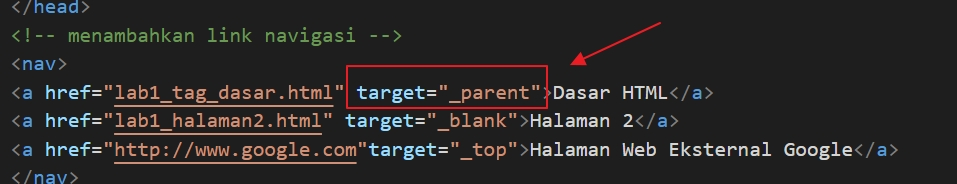

 >**Atribut target ``_blank``**: browser akan menampilan/Membuka dokumen yang ditautkan di jendela atau tab baru.<br>
 >**Atribut target ``_self``**: browser akan menampilan/Membuka dokumen yang ditautkan di jendela / tab yang sama seperti yang diklik (ini adalah default).<br>
 >**Atribut target ``_top``**: browser akan menampilan/Membuka dokumen yang ditautkan di seluruh jendela.<br>
 >**Atribut target ``_parent``**: browser akan menampilan/Membuka dokumen yang ditautkan dalam bingkai induk.<br>


Cukup sekian Penjelasan dari saya.

**Terimakasih**
 